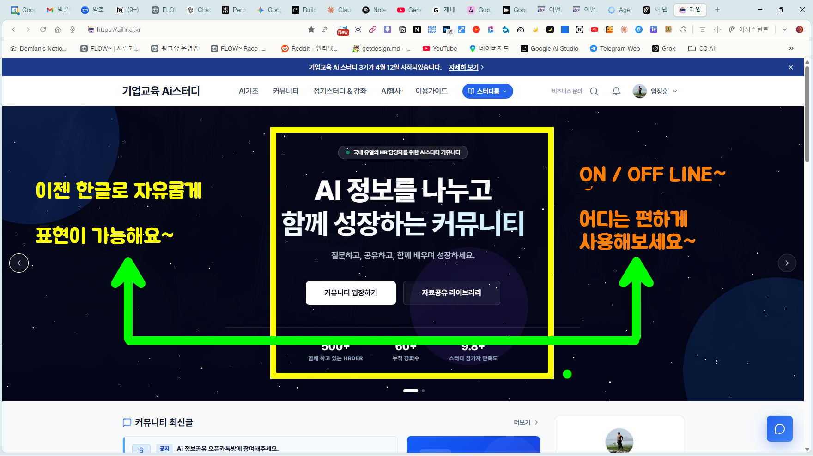
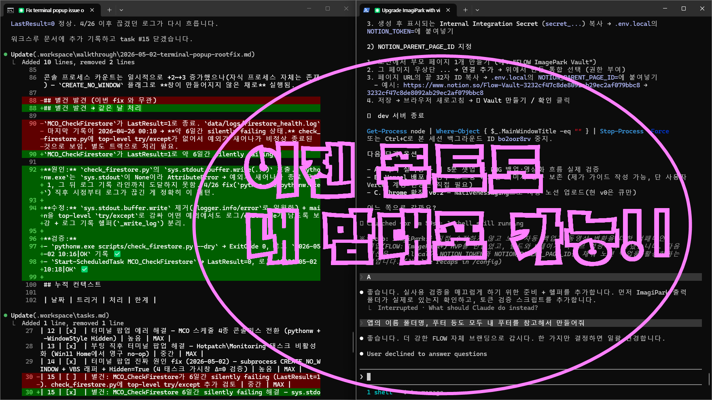
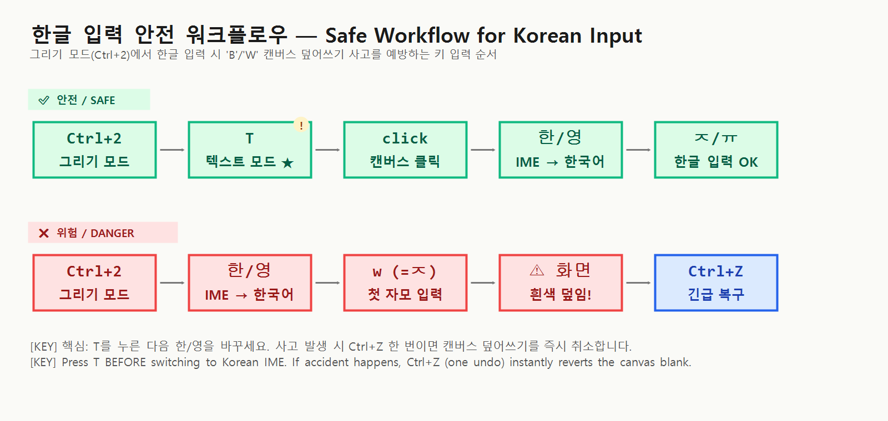

# FLOW ZoomIt

> A Korean-friendly distribution of Microsoft Sysinternals **ZoomIt v11.0** for Windows — **Korean text input now works**, bundled with **handwriting fonts**, **a full pen-color palette (red · green · blue · yellow · orange · pink…)**, larger arrowheads, autostart, and bilingual UX. Built for Korean trainers, coaches, and presenters.
>
> 한국어 강의·워크숍·코칭을 위한 Microsoft Sysinternals **ZoomIt v11.0** 배포판. 
**이젠 한글로 자유롭게 표현이 가능**하며, 
**손글씨 폰트**·**원하는 색상(빨강·초록·파랑·노랑·주황·핑크 등)**·
강조된 화살표·자동 시작·양국어 UX를 한 번에.


> 💬 **창작자의 진심 / From the creator**
>
> 🇰🇷 *"기존 줌잇은 한글 입력이 안되었죠? FLOW ZOOMIT 은 가능합니다. 기다림과 불편함에 제가 직접 만들었어요. 마음껏 편하게 사용하세요~"*
>
> 🇬🇧 *"The original ZoomIt couldn't type Korean. FLOW ZoomIt can. I built it myself, frustrated by the wait. Please use it freely."*
>
> — **임정훈 소장 · Junghoon Lim**, Director · AI Coordinator, FLOW: AX 디자인연구소

🌐 Live demo · 라이브 데모: <https://flowdesign.ai.kr>

---

## 🎨 What's new in v11 / v11.0 의 차이

| | v4.52 (old) | **v11.0 (FLOW ZoomIt)** |
|---|---|---|
| 한글 텍스트 입력 / Korean text | ❌ Broken | ✅ **Native** — 한/영 토글로 즉시 입력 |
| 폰트 / Font | 시스템 기본만 / system default only | ✅ **자유 선택** — 나눔바른펜 Bold 기본, Options 에서 변경 |
| 펜 색상 / Pen color | 6색 가능하나 시인성 부족 | ✅ **6색 + 시인성** — Red·Green·Blue·Yellow·Orange·Pink, 굵기 15 기본 |
| 단축키 / Shortcuts | Ctrl+1~4 만 | ✅ **9개** — 정적·라이브 줌, 그리기, 휴식 타이머, 녹화, 캡처, 데모타입, 파노라마, OCR |
| 한국어 설치 가이드 | 없음 | ✅ **양국어 README + about 페이지** |

---

## 📖 만든 이의 이야기 / Maker's note

### 🇰🇷 한글이 안 되는 ZoomIt — 그래서 직접 만들었습니다

오늘은 여러분께 도움이 될지도 모를 작은 앱 하나를 전해드립니다.

반갑습니다. **FLOW: AX 디자인연구소** 임정훈 소장입니다. 오랜만에 글을 쓰네요. 온·오프라인 강의·워크샵에서 PC 화면의 중요한 부분을 강조할 때, Microsoft 의 **ZoomIt** 을 많이들 쓰시죠? 확대·네모·원·문자 입력 같은 강력한 기능이 있지만 영문만 가능하고 **한글이 입력되지 않아서** 항상 아쉬움이 많았습니다.

"언젠가 되겠지" 하는 기다림과 "여전히 안 되네" 하는 불편함에, 한글 기능과 손글씨 폰트, 다양한 색상까지 더한 **FLOW ZoomIt** 을 바이브 코딩으로 직접 만들었어요.

### 🛠️ 그 뒤에 숨은 기술 여정

처음엔 ZoomIt 을 처음부터 다시 짜려 했습니다. **자체 IME 를 가진 Electron 기반 "ZoomIt-Pro" 빌드를 5번 시도했지만**, 투명 윈도우와 한국어 IME 의 비양립으로 모두 실패했어요. 그러다 2026년 5월, **ZoomIt v11.0 이 한국어를 정상 지원**한다는 사실을 확인하고 "재개발 대신, **v11.0 을 한국어 강의 환경에 맞게 패키징**" 하는 방향으로 전환했습니다. 본체 갱신 + 손글씨 폰트 + 화살표 시인성 + 자동 시작까지 한 번에 세팅됩니다.

### 🌱 AI 코디네이터로 독립한 지 두 달

AI 대전환의 시대, 사람과 일의 흐름을 연결하고 조직의 성장과 성과를 지원한다는 AX 에 대한 사명과 소명을 가지고, **AI 코디네이터** 로 지난 3월 1일에 프리랜서로 독립했습니다. 어느새 두 달이 넘었네요.

퇴사 전부터 치열하게 고민했던 부분들이 — 일부는 성과로, 일부는 숙제로, 일부는 압박으로 — 다가와, 눈을 떠도 눈을 감아도 AI·AX 로 몸과 맘이 한가득입니다. 으으, 프리랜서의 삶이란 이런 것이군요. 선배님들, 존경합니다... ㅠㅠ

### 🧪 200 개 넘게 만들었고, 미완성도 그만큼

2024년부터 혼자서 하나둘 만들기 시작한 게 어느새 **200개**가 넘어갑니다 — 프롬프트 카드, 다양한 디자인의 홈페이지·슬라이드 앱, 워크샵 앱, 고객분석 앱, AX 앱, 캐릭터 앱, 회의 퍼실리테이션 앱, 강의 운영 앱, 패들렛/슬라이도/멘티미터 통합 앱, 팀 빌딩 앱, **청각장애인을 위한 영상·음성 모드 안내 앱**(주위 소리·입술 모양·뒤에서 다가오는 차량을 거리와 함께 화면에 텍스트·아이콘·영상으로 안내), **음성으로 화면을 터치하는 접근성 앱**(화면 터치·마우스 조작이 어려운 분을 위한 음성 기반 화면 조작), **가족·장애인 위치 공유 안내 앱**(서로의 위치를 확인하고 안전한 안내를 주고받는 도구)… 등등.

기술력이 부족해서, 욕심을 너무 많이 넣어서, 완성도는 높은데 효용성이 떨어져서, 디자인이 너무 후져서, 트리거가 작동하지 않아서… **완성된 것보다 미완성된 것이 더 많고**, 강의 전일·당일 오작동되는 앱들로 날을 새기도 합니다.

### 💌 그래서 이제 하나둘 풀어냅니다

그동안의 고민과 노력 중 **사람들이 쓸 만한 것들** 을 하나둘 풀어내려 합니다. 이미 많은 분들이 많은 것들을 만들고 계시고, 과거의 고민이 요즘은 기본 기능으로 수월하게 동작하기도 합니다. 하지만 몸과 맘으로 고민하고 고생했던 부분들이 **지금의 AI 를 이해하고 전하는 데** 큰 도움이 되고 있어서, 이 이야기들을 같이 나누고 싶어요.

편하게 다운로드해 사용해 주시고, 개선이 필요한 부분은 말씀해 주세요. 항상 많이 배우고 느끼며 앞으로 나아갑니다. **고맙습니다.**

— *임정훈 소장 · FLOW: AX 디자인연구소*

---

### 🇬🇧 The story behind FLOW ZoomIt

Hi, I'm **Junghoon Lim**, Director of **FLOW: AX Design Lab**. When you emphasize parts of your screen during lectures and workshops, you've probably reached for Microsoft's **ZoomIt** — but the older build couldn't render Korean text, and many trainers (myself included) were frustrated for years.

I first tried rebuilding ZoomIt from scratch — **five Electron-based "ZoomIt-Pro" prototypes with custom Korean IMEs, all failed** because transparent Chromium windows are incompatible with Hangul composition. In May 2026, I confirmed that ZoomIt **v11.0** finally handles Korean correctly out of the box, so I pivoted from "rewrite" to **"package v11.0 for Korean classroom use"** — adding handwriting fonts, larger arrowheads, autostart, and a six-color pen palette.

This is also one of my first releases since I went independent on **March 1, 2026** as an AI Coordinator. Since 2024 I've built **200+ small tools alone** — prompt cards, workshop apps, customer-research dashboards, AX task-rebuilders, character-merch generators, facilitation supports, lecture-logistics tools, all-in-one Padlet/Slido/Mentimeter clones, persona-driven team-building apps, **an accessibility app for the deaf and hard-of-hearing** that surfaces ambient sounds, lip-reading cues, and approaching vehicles (with distance) as on-screen text/icons/video, **a voice-driven screen-touch app** for users who can't operate touchscreens or a mouse, and **a location-sharing companion app** for families caring for someone with a disability. Most are unfinished — for every reason imaginable. I'm going to release the ones that survived, one by one.

Use it freely. Tell me what should improve. Thank you for being here.

📜 **Full retrospective:** [STORY.md](STORY.md)

---

## 📦 Quick install — 3 clicks / 3번 클릭이면 끝

> **개발 도구 없이도 바로 설치 가능 / No git, no terminal needed.**

1. **Download** — [⬇️ FLOW-ZoomIt-Online-v1.0.5.zip (2.5 MB)](https://github.com/Demian-Yim/flow-zoomit/releases/download/v1.0.5/FLOW-ZoomIt-Online-v1.0.5.zip)
2. **Unzip** the file (right-click → Extract All / 압축 풀기)
3. **Double-click** `installer\Install-Online.bat`
   - 설치 프로그램이 Microsoft 에서 ZoomIt v11.0 을 자동으로 받아서 설치합니다.
   - 관리자 권한 불필요 / No admin rights required.
   - 설치 후 **Win+Z** 로 메뉴 확인, 또는 **Ctrl+2 → T** 로 한글 입력 테스트.

[📥 모든 다운로드 / All downloads](https://github.com/Demian-Yim/flow-zoomit/releases/latest)

---

## 🚀 Install (advanced) / 설치 (개발자용)

### Option A — Online installer / 온라인 설치 (Microsoft 에서 본체 자동 다운로드)

Downloads ZoomIt v11.0 from Microsoft at install time. No binary in this repo. Smallest, license-safest.

```powershell
# 1. Clone or download this repo
git clone https://github.com/Demian-Yim/flow-zoomit.git
cd flow-zoomit\installer

# 2. Run the online installer (no admin needed)
.\Install-Online.bat
```

Or one-liner (PowerShell):

```powershell
iex "& { $(irm https://raw.githubusercontent.com/Demian-Yim/flow-zoomit/main/installer/install-online.ps1) }"
```

### Option B — Offline installer / 오프라인 설치

Use this if you already have `ZoomIt64.exe` (place it next to `install.ps1`).

`ZoomIt64.exe` 를 이미 가지고 있는 경우 (스크립트 옆에 배치).

```powershell
cd installer
.\Install.bat
```

### What gets installed / 설치 결과

| Path | Purpose |
|------|---------|
| `%LOCALAPPDATA%\FLOW-ZoomIt\ZoomIt64.exe` | Main executable / 본체 |
| `%LOCALAPPDATA%\FLOW-ZoomIt\about.html` | Local info page / 정보 페이지 |
| `%LOCALAPPDATA%\FLOW-ZoomIt\Uninstall.bat` | Uninstaller / 제거 도구 |
| Start Menu \ FLOW-ZoomIt | App + Info shortcuts / 앱·정보 바로가기 |
| Desktop / 바탕화면 | App shortcut / 앱 바로가기 |
| Startup / 시작프로그램 | Autostart at boot / 자동 실행 |
| HKCU\Software\Sysinternals\ZoomIt | Hotkeys, font, pen settings |

---

## 🎯 9 core features / 9가지 핵심 기능

| Hotkey | Feature | 한국어 |
|--------|---------|--------|
| `Ctrl+1` | Static Zoom | 정적 줌 |
| `Ctrl+2` | Draw mode | 그리기 모드 |
| `Ctrl+3` | Break Timer | 휴식 타이머 |
| `Ctrl+4` | Live Zoom | 라이브 줌 |
| `Ctrl+5` | **Recording** (MP4/GIF + audio) | **화면 녹화** |
| `Ctrl+6` | Snip | 화면 캡처 |
| `Ctrl+7` | **Demo Type** (auto-typing) | **데모 타입** |
| `Ctrl+8` | **Panorama Snip** (long-scroll capture) | **파노라마 캡처** |
| `Ctrl+Shift+6` | **OCR Snip** | **OCR 캡처** |

### Draw-mode shortcuts / 그리기 모드 단축키

| Key | Action |
|-----|--------|
| `R G B Y O P` | Pen color: Red Green Blue Yellow Orange Pink |
| `Drag` | Free-pen stroke / 자유 펜 |
| `Shift+Drag` | Straight line with arrowhead / 직선 + 화살표 |
| `Ctrl+Drag` | Rectangle / 사각형 |
| `Tab+Drag` | Ellipse / 타원 |
| `Wheel` | Adjust pen width / 펜 굵기 |
| `T` | Text mode / 텍스트 모드 |
| **`B`** | ⚠️ **Blank black canvas (전체 덮어쓰기)** — `Ctrl+Z` 로 취소 |
| **`W`** | ⚠️ **Blank white canvas (전체 덮어쓰기)** — `Ctrl+Z` 로 취소 |
| `E` | Erase all drawings / 모든 그림 지우기 |
| `Ctrl+Z` | **Undo** (B/W 덮어쓰기 취소 포함) |
| `ESC` | Exit / 종료 |

---

## ⚙️ FLOW defaults / FLOW 기본 설정

| Setting | Value |
|---------|-------|
| Engine / 본체 | ZoomIt v11.0 (Microsoft Sysinternals · 2026-03 build) |
| Install path | `%LOCALAPPDATA%\FLOW-ZoomIt\` |
| Default font | **나눔바른펜 Bold** (Nanum Barun Pen Bold) — Hangul charset, antialiased |
| Pen width | **15** — arrowhead width tuned for visibility |
| Pen color | Red (changeable in Options — 6색 자유 선택) |
| Autostart | Registered in Windows Startup |
| Admin rights | Not required (per-user install) |

---

## 🌈 Color & font freedom / 색상·폰트 자유도



> **여러 색상을 동시에** — Y(노랑) 박스, P(핑크) 라벨, G(초록) 화살표를 한 화면에서 자유롭게 사용. 강의·발표·시연·튜토리얼 어디서든 강조 포인트가 명확해집니다.
>
> **Mix multiple colors at once** — Y (yellow) box, P (pink) labels, G (green) arrows on the same screen. Strong emphasis for lectures, demos, walkthroughs, and tutorials.



> **핑크 컬러 같은 원하는 색상을** — 코드·터미널 위에서도 핑크 같은 강조 색이 잘 보이고, 빠른 키 한 번(`P`)으로 즉시 전환됩니다.
>
> **Pick the color you want** — Even on dark code or terminal screens, vivid hues like pink stand out. Single-key swap with `P` (and `R G B Y O` for the rest).

---

## 🇰🇷 Korean text on slides / 한글 텍스트

`Ctrl+2` → `T` → click on canvas → press `한/영` → type Korean → `Enter`

> **이젠 한글로 자유롭게** — v11.0 부터 한국어 텍스트 입력이 정상 작동합니다. 손글씨 폰트(나눔바른펜 Bold)가 기본 적용되어 강의 분위기에 자연스럽게 녹아듭니다. 폰트는 트레이 아이콘 → Options → Type 에서 자유롭게 변경할 수 있습니다.
>
> **Korean text now works** — v11.0 fixes the legacy Hangul rendering issue. A handwriting font (Nanum Barun Pen Bold) is preset for a friendly classroom tone. Change it any time via tray icon → Options → Type.

> **IME caveat:** The Windows IME composition window may appear in the top-left corner because ZoomIt does not anchor it to the cursor. Input itself works fine. To hide: Settings → Time & Language → Korean → Microsoft IME → Options → Appearance.
>
> **IME 주의:** ZoomIt이 IME 위치를 커서에 고정하지 않아 좌상단에 후보창이 뜰 수 있습니다. 입력 자체에는 영향 없음.

---

## ⚠️ `B`/`W` 캔버스 덮어쓰기 주의 / Canvas-blank gotcha



> 🇰🇷 **그리기 모드(Ctrl+2)에서 `T` 를 누르기 전**에 한/영을 한국어로 바꾸고 자모를 입력하면, 첫 키가 `b`(=ㅠ) 또는 `w`(=ㅈ) 일 때 화면이 통째로 검정·흰색으로 덮입니다 — 이는 ZoomIt 그리기 모드의 단독 단축키 동작입니다. 두벌식에서 ㅈ(자/저/주/지)·ㅠ가 흔하기 때문에 강의 중 사고가 잦습니다.
>
> ✅ **안전 순서:** `Ctrl+2` → **`T` 먼저** → 캔버스 클릭 → `한/영` → 한글 입력
> 🆘 **사고 시 복구:** `Ctrl+Z` 한 번 — 캔버스 덮어쓰기 즉시 취소
>
> 🇬🇧 In Draw mode, pressing standalone `B`/`W` blanks the canvas to black/white. If you toggle Korean IME **before** pressing `T`, your first Hangul keystroke can trigger this (ㅈ=`w`, ㅠ=`b`). Always press **`T` first**, click the canvas, then switch IME. Recovery: **`Ctrl+Z`** (one undo).

---

## 🗑️ Uninstall / 제거

```powershell
%LOCALAPPDATA%\FLOW-ZoomIt\Uninstall.bat
```

Removes files, shortcuts, and autostart. Registry settings (hotkeys, font) are kept by default — you can choose to wipe them during uninstall.

설치 파일·바로가기·자동 실행 모두 제거. 레지스트리 설정은 기본 유지(재설치 시 복원에 유리), 제거 시 선택 가능.

---

## 📜 License / 라이선스

- **FLOW packaging scripts** (`installer/`, `about.html`, screenshots, README) — **MIT License** — see [LICENSE](LICENSE)
- **ZoomIt** — Microsoft Sysinternals Software License — *not redistributed; downloaded from Microsoft at install time in online mode*
- **Nanum Fonts** — SIL Open Font License / Naver Free-Use — already pre-installed on Korean Windows

본 저장소의 FLOW 패키징 스크립트는 MIT. ZoomIt 본체는 Microsoft Sysinternals 라이선스 하 Microsoft 에서 직접 다운로드. 나눔글꼴은 Naver 무료 사용 라이선스.

---

## 🛠️ Built with / 기술 스택

- PowerShell 5.1+ (installer logic)
- Windows IExpress (single-EXE packaging, optional)
- HTML/CSS (about page, this README)
- Microsoft Sysinternals ZoomIt v11.0 (the engine)

---

## 🤝 Contributing / 기여

Issues and PRs welcome. The packaging is intentionally minimal — most "improvements" should land in Microsoft's upstream ZoomIt. This project's scope is opinionated Korean-classroom defaults.

이슈·PR 환영. 패키징은 의도적으로 최소한만 — 대부분의 개선은 Microsoft 업스트림 ZoomIt 에 들어가야 합니다. 본 프로젝트는 "한국어 강의 환경 기본값" 범위만.

---

## 📬 Author / 제작

**FLOW: AX Design Lab — FLOW: AX 디자인연구소**
Director · AI Coordinator (AI 코디네이터)
by **Demian Yim** ·
🌐 <https://flowdesign.ai.kr>

© 2026 FLOW: AX 디자인연구소 · FLOW: AX Design Lab — All Rights Reserved.
