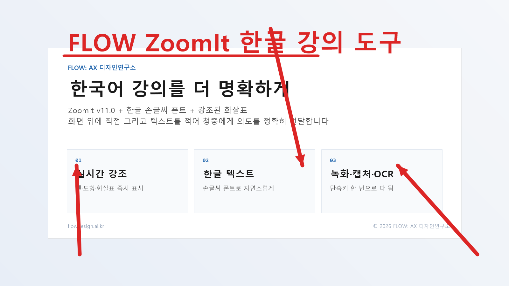
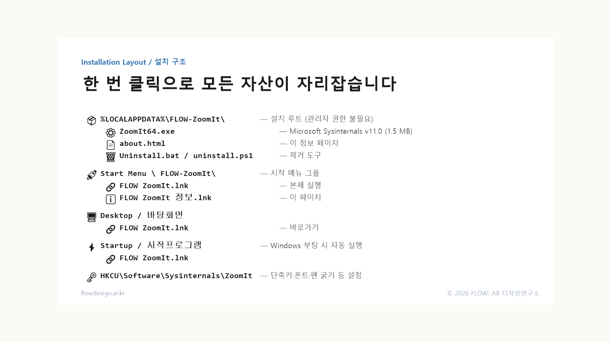
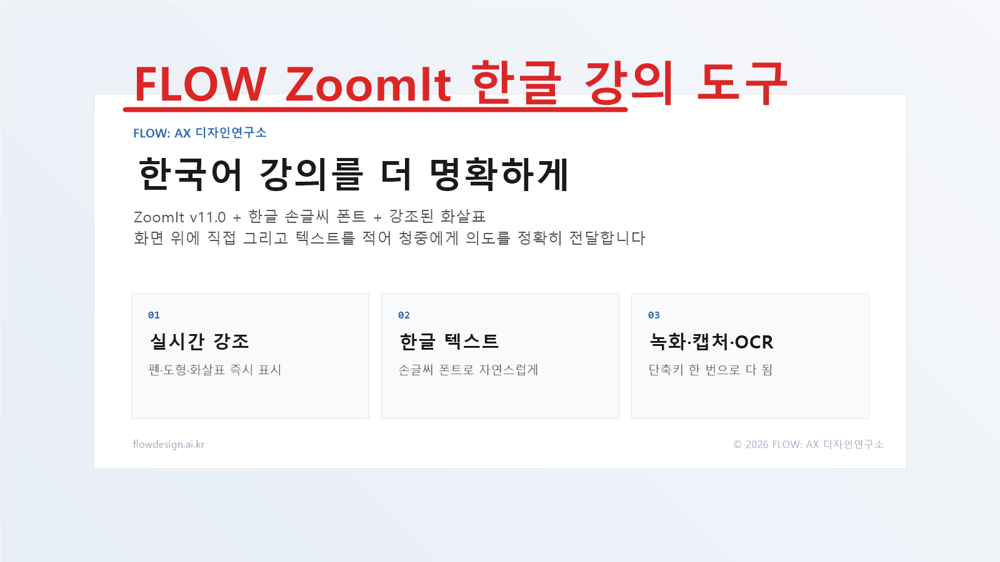

# FLOW ZoomIt

> A Korean-friendly distribution of Microsoft Sysinternals **ZoomIt v11.0** for Windows — bundled with handwriting fonts, larger arrowheads, autostart, and bilingual UX. Built for Korean trainers, coaches, and presenters.
>
> 한국어 강의·워크숍·코칭을 위한 Microsoft Sysinternals **ZoomIt v11.0** 배포판. 손글씨 폰트·강조된 화살표·자동 시작·양국어 UX를 한 번에.



🌐 Live demo · 라이브 데모: <https://flowdesign.ai.kr>

---

## ✨ Why this exists / 왜 만들었나

ZoomIt is a battle-tested screen-annotation tool from Microsoft Sysinternals, but its older v4.52 build could not render Korean characters. We tried five Electron-based "ZoomIt-Pro" rewrites with custom IMEs — all failed due to transparent-window/Korean-IME incompatibility.

In May 2026 we verified that **ZoomIt v11.0** handles Korean correctly out of the box, and pivoted from "rewrite" to **"package v11.0 for Korean classroom use."** This installer ships the v11.0 binary plus opinionated defaults so Korean trainers can install once and teach.

ZoomIt은 Microsoft Sysinternals의 검증된 화면 강조 도구지만 구버전(v4.52)은 한글이 렌더링되지 않았습니다. Electron 기반 자체 IME 시도 5번 모두 실패한 뒤, **v11.0이 한글을 정상 처리**함을 확인하고 "재개발 대신 한국어 강의 환경에 맞게 패키징"으로 방향을 전환했습니다.

---

## 🚀 Install / 설치

### Option A — Online installer (recommended) / 온라인 설치 (권장)

Downloads ZoomIt v11.0 from Microsoft at install time. No binary in this repo. Smallest, license-safest.

설치 시점에 Microsoft 에서 ZoomIt 본체를 다운로드. 본 저장소에 바이너리 없음. 가장 작고 라이선스 안전.

```powershell
# 1. Clone or download this repo
git clone https://github.com/Demian-Yim/flow-zoomit.git
cd flow-zoomit\installer

# 2. Run the online installer (no admin needed)
.\Install-Online.bat
```

Or one-liner (PowerShell):

```powershell
iex "& { $(irm https://raw.githubusercontent.com/Demian-Yim/flow-zoomit/main/installer/install-online.ps1) }"
```

### Option B — Offline installer / 오프라인 설치

Use this if you already have `ZoomIt64.exe` (place it next to `install.ps1`).

`ZoomIt64.exe` 를 이미 가지고 있는 경우 (스크립트 옆에 배치).

```powershell
cd installer
.\Install.bat
```

### What gets installed / 설치 결과



| Path | Purpose |
|------|---------|
| `%LOCALAPPDATA%\FLOW-ZoomIt\ZoomIt64.exe` | Main executable / 본체 |
| `%LOCALAPPDATA%\FLOW-ZoomIt\about.html` | Local info page / 정보 페이지 |
| `%LOCALAPPDATA%\FLOW-ZoomIt\Uninstall.bat` | Uninstaller / 제거 도구 |
| Start Menu \ FLOW-ZoomIt | App + Info shortcuts / 앱·정보 바로가기 |
| Desktop / 바탕화면 | App shortcut / 앱 바로가기 |
| Startup / 시작프로그램 | Autostart at boot / 자동 실행 |
| HKCU\Software\Sysinternals\ZoomIt | Hotkeys, font, pen settings |

---

## 🎯 9 core features / 9가지 핵심 기능

| Hotkey | Feature | 한국어 |
|--------|---------|--------|
| `Ctrl+1` | Static Zoom | 정적 줌 |
| `Ctrl+2` | Draw mode | 그리기 모드 |
| `Ctrl+3` | Break Timer | 휴식 타이머 |
| `Ctrl+4` | Live Zoom | 라이브 줌 |
| `Ctrl+5` | **Recording** (MP4/GIF + audio) | **화면 녹화** |
| `Ctrl+6` | Snip | 화면 캡처 |
| `Ctrl+7` | **Demo Type** (auto-typing) | **데모 타입** |
| `Ctrl+8` | **Panorama Snip** (long-scroll capture) | **파노라마 캡처** |
| `Ctrl+Shift+6` | **OCR Snip** | **OCR 캡처** |

### Draw-mode shortcuts / 그리기 모드 단축키

| Key | Action |
|-----|--------|
| `R G B Y O P` | Pen color: Red Green Blue Yellow Orange Pink |
| `Drag` | Free-pen stroke / 자유 펜 |
| `Shift+Drag` | Straight line with arrowhead / 직선 + 화살표 |
| `Ctrl+Drag` | Rectangle / 사각형 |
| `Tab+Drag` | Ellipse / 타원 |
| `Wheel` | Adjust pen width / 펜 굵기 |
| `T` | Text mode / 텍스트 모드 |
| `Ctrl+Z` | Undo |
| `ESC` | Exit / 종료 |

---

## ⚙️ FLOW defaults / FLOW 기본 설정

| Setting | Value |
|---------|-------|
| Engine / 본체 | ZoomIt v11.0 (Microsoft Sysinternals · 2026-03 build) |
| Install path | `%LOCALAPPDATA%\FLOW-ZoomIt\` |
| Default font | **나눔바른펜 Bold** (Nanum Barun Pen Bold) — Hangul charset, antialiased |
| Pen width | **15** — arrowhead width tuned for visibility |
| Pen color | Red (changeable in Options) |
| Autostart | Registered in Windows Startup |
| Admin rights | Not required (per-user install) |


---

## 🇰🇷 Korean text on slides / 한글 텍스트

`Ctrl+2` → `T` → click on canvas → press `한/영` → type Korean → `Enter`



> **IME caveat:** The Windows IME composition window may appear in the top-left corner because ZoomIt does not anchor it to the cursor. Input itself works fine. To hide: Settings → Time & Language → Korean → Microsoft IME → Options → Appearance.
>
> **IME 주의:** ZoomIt이 IME 위치를 커서에 고정하지 않아 좌상단에 후보창이 뜰 수 있습니다. 입력 자체에는 영향 없음.

---

## 🗑️ Uninstall / 제거

```powershell
%LOCALAPPDATA%\FLOW-ZoomIt\Uninstall.bat
```

Removes files, shortcuts, and autostart. Registry settings (hotkeys, font) are kept by default — you can choose to wipe them during uninstall.

설치 파일·바로가기·자동 실행 모두 제거. 레지스트리 설정은 기본 유지(재설치 시 복원에 유리), 제거 시 선택 가능.

---

## 📜 License / 라이선스

- **FLOW packaging scripts** (`installer/`, `about.html`, screenshots, README) — **MIT License** — see [LICENSE](LICENSE)
- **ZoomIt** — Microsoft Sysinternals Software License — *not redistributed; downloaded from Microsoft at install time in online mode*
- **Nanum Fonts** — SIL Open Font License / Naver Free-Use — already pre-installed on Korean Windows

본 저장소의 FLOW 패키징 스크립트는 MIT. ZoomIt 본체는 Microsoft Sysinternals 라이선스 하 Microsoft 에서 직접 다운로드. 나눔글꼴은 Naver 무료 사용 라이선스.

---

## 🛠️ Built with / 기술 스택

- PowerShell 5.1+ (installer logic)
- Windows IExpress (single-EXE packaging, optional)
- HTML/CSS (about page, this README)
- Microsoft Sysinternals ZoomIt v11.0 (the engine)

---

## 🤝 Contributing / 기여

Issues and PRs welcome. The packaging is intentionally minimal — most "improvements" should land in Microsoft's upstream ZoomIt. This project's scope is opinionated Korean-classroom defaults.

이슈·PR 환영. 패키징은 의도적으로 최소한만 — 대부분의 개선은 Microsoft 업스트림 ZoomIt 에 들어가야 합니다. 본 프로젝트는 "한국어 강의 환경 기본값" 범위만.

---

## 📬 Author / 제작

**FLOW: AX Design Lab — FLOW: AX 디자인연구소**
by **Junghoon Lim · 임정훈** · Director · AI Coordinator (AI 코디네이터)
🌐 <https://flowdesign.ai.kr>

© 2026 FLOW: AX 디자인연구소 · FLOW: AX Design Lab — All Rights Reserved.
